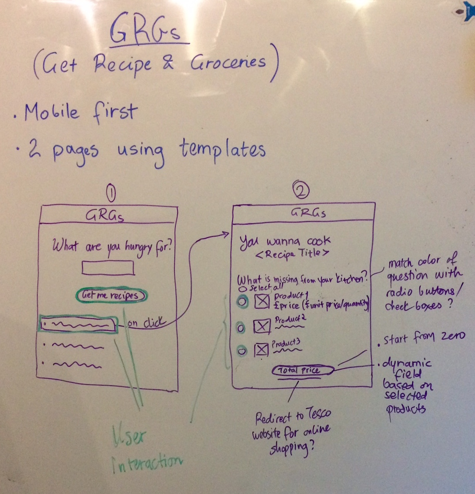

# Status

![[Build Status]https://travis-ci.org/NodeGroup2/GRAGS.svg?branch=master](https://travis-ci.org/NodeGroup2/GRAGS.svg?branch=master)

# GRAGS

A Hapi app for searching recipes and requesting Tesco shopping lists. Available online at .

## General objectives

- Build a simple hapi app
- Use test driven development
- Query at least two APIs on the backend
- Use data to populate a handlebars template
- Display server-rended page on the front-end
- Aim for high test-coverage on front-end and back-end
- Host the project on heroku
- Use basic ES6 syntax

## Specific objectives

- Implement a recipe search API ([Recipe puppy](http://www.recipepuppy.com/))
- Implement a grocery search API ([Tesco](https://devportal.tescolabs.com/))
- Provide ingredients checklist
- Provide total cost calculation for selected ingredients

## User story

As a... **beginner cook with a busy lifestyle and a Tesco Clubcard**,  
I want to... **find a recipe and a shopping list of ingredients**  
so that... **I know what I need to get from Tesco and how much it will cost.**  

## User expectations
- When I open the page, I want to see a recipe search box.
- If I don't search for anything, I don't expect any results.
- When I search for a recipe, I want to get 3 recipe options.
- If there are no found recipes, I expect a prompting message to search for a different recipe.
- When I click on a recipe, I want to see the ingredients including a product image, details and how much they cost at Tesco (I have a clubcard). 
- When some of the ingredients are not found at Tesco, I want to see them in the list without price. 
- When the ingredient list loads on my page, I want to be able to select the missing ingredients.
- Upon selection of the items I need, I want to see the total price.
- I want to be able to select all ingredients at once. 
- If I change my mind, I want the price to be adjusted accordingly.

*These expectations will drive our testing*

## Project plan

### Monday
- develop ideas
- user story
- research APIs
- wireframes
- implement Travis

### Tuesday
- set up a simple Hapi server using TDD
- define endpoints from front-end to back-end
- add API keys as environment variables using ENV2
- add templates for server rendering of webpages
- add front-end interactivity
- ...

### Wednesday

## Front-end design

## Folder structure
- public
  - templates
    - index.html
  - helpers
  - styles.css
  - index.js
- src
  - router.js
  - handler.js
  - other modules
- tests
  - tape-tests.js
  - qunit-tests.js
- server.js
- package.json
- qunit.html
- .gitignore

### Testing

- Unit testing
- Front-end using qUnit
- Back-end using Tape
- Code coverage using Istanbul
- Continuous integration using Travis
